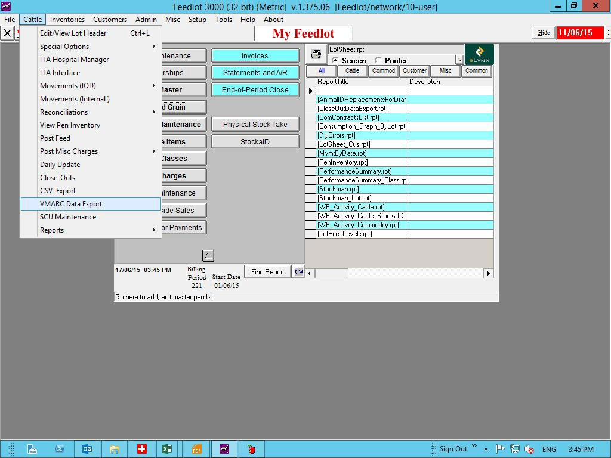
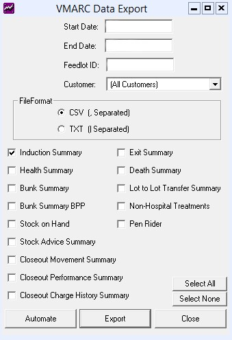

\newpage

# FY3000 Exports

## Where To Find VMARC Exports  
To find the VMARC data exports please go to *Cattle > VMARC Data Export*  



\newpage

## VMARC Export Interface  


\newpage

## VMARC Data Exports  

#### Pre-Conditions  
All the data for the period of exporting must be entered and finalised in
Stockaid and FY3000 to ensure all data is captured and reconciled.

#### Frequency  

```{r freq, echo=FALSE}
if (params$freq == "biweekly") {
  freqText <- paste(
    "VMARC data files should be sent on Tuesday and Friday.",
    "Please send these as soon as posible after the Pre-Conditions are met.",
    "If you fall behind schedule please continue sending VMARC data files as if",
    "you are still on schedule, Eg. If it is Thursday and you are yet to send",
    "the report intended to be sent on Tuesday, please send through the VMARC",
    "data files for the previous Friday to Tuesday period."
  )
  freqTable <- knitr::kable(
    data.frame(
      "Day of Export" = c("Tuesday", "Friday", "1st Jan 2021"),
      "Start Date" = c("Previous Friday", "Previous Tuesday", "29th Dec 2020"),
      "End Date" = c("Monday", "Thursday", "31st Dec 2020"),
      check.names = FALSE
    ), 
    format = "simple",
    caption = "When data should be sent"
  )
  twoPeriods <- paste(
    "If start date for the other VMARC data files was the 29th Dec 2020",
    "then the start date for the Exit Summary VMARCdata file should be 24th Dec 2020"
  )
} else if (params$freq == "weekly") {
  freqText <- paste(
    "VMARC data files should be sent weekly.",
    "Please send these as soon as posible after the Pre-Conditions are met."
  )
    freqTable <- knitr::kable(
    data.frame(
      "Day of Export" = c("Tuesday", "1st Jan 2021"),
      "Start Date" = c("Previous Monday", "21st Dec 2020"),
      "End Date" = c("Previous Sunday", "27th Dec 2020"),
      check.names = FALSE
    ), 
    format = "simple",
    caption = "When data should be sent"
  )
  twoPeriods <- paste(
    "If start date for the other VMARC data files was the 21st Dec 2020",
    "then the start date for the Exit Summary VMARC data file should be 14th Dec 2020"
  )
}
```

`r freqText`
`r freqTable`

#### Feedlot ID
Your allocated AHD Feedlot ID is `r params$fid` and must be entered into the
Feedlot ID field on the VMARC Export screen.

#### File Format 
must be **CSV**.

#### Export  
If you have any issue with exporting the VMARC data files please try
exporting them **one** at a time by only ticking one of the boxes.
If we notice issues with the exports we are receiving or if we are missing
VMARC data files for some periods we may ask you to re-export data for older period,
and sometimes in bulk. If we ask for large periods of data we advise generating
the file for **one month** blocks. 


#### Files to be exported:
* Induction Summary
* Health Summary
* Bunk Summary
* Bunk Summary BPP
* Exit Summary[^1]
* Death Summary
* Lot to Lot Transfer Summary
* Non-Hospital Treatments
* Stock on Hand[^2]

[^1]: Exit Summary should be exported for a 2 periods to make sure all 
data is entered and reconcilied in Stockaid and FY3000. `r twoPeriods`
[^2]: The Stock on Hand export should be done seperately, 
but should be sent with the other VMARC data files.

\newpage

## Closeout Reports

#### Pre-Condition
Closeout reports should be exported only after entering the *Dressing Percentages*
and checking the Closeouts for the previous month.

#### Frequency
Closeout reports are exported at the beginning of each month for the previous
calendar month after the Pre-Condition is met.

#### Date Range

* Start Date should be the first day of the previous month
* End Date should be the last day of the previous month

If it is the first week of December, then the Closeout reports should be exported
for the **1st Nov** to the **30th Nov**.

#### Feedlot ID
Your allocated AHD Feedlot ID is `r params$fid` and must be entered into the
Feedlot ID field on the VMARC Export screen.

#### File Format 
must be **CSV**.

#### Export  
To ensure the correct Closeout data files are exported please selected the 
following **three** files to export.

#### Files to be exported
* Closeout Movement Summary
* Closeout Performance Summary
* Closeout Charge History Summary

\newpage

## Pen Rider

#### Pre-Condition
Pen Rider export should be exported only after entering the pen rider data-entry
is complete.

#### Frequency
Pen Rider file is exported at the beginning of each month for the previous
calendar month after the Pre-Condition is met.

#### Date Range

* Start Date should be the first day of the previous month
* End Date should be the last day of the previous month

If it is the first week of December, then the Pen Rider export should be exported
for the **1st Nov** to the **30th Nov**.

#### Feedlot ID
Your allocated AHD Feedlot ID is `r params$fid` and must be entered into the
Feedlot ID field on the VMARC Export screen.

#### File Format 
must be **CSV**.

#### Export the Pen Rider file.

\newpage

## Send Files

1. Once the export is complete - close the VMARC Export Interface
2. Send an email to 
\textcolor{blue}{data@animalhealthdata.com.au}
with the Email Subject 
*`r paste(params$fid, "VMARCS 01/01/2020")`*
3. With the exported files attached
4. The attached must be following the naming rules below  

The file names must be of the format with the angled brackets removed. 

> `<Feedlot ID>_<Export Short Name>_<Export Datetime>.CSV`

See the table below for more examples.

```{r naming convention, echo=FALSE}
shortNames <- c(
  "ind", "hea", "bun", "bpp", "ext", "dth", "ltl", "trt", "soh", 
  "closem", "closep", "closechm"
)
knitr::kable(
  data.frame(
    Export = c(
      "Induction Summary",
      "Health Summary",
      "Bunk Summary",
      "Bunk Summary BPP",
      "Exit Summary",
      "Death Summary",
      "Lot to Lot Transfer Summary",
      "Non-Hospital Treatments",
      "Stock on Hand",
      "Closeout Movement Summary",
      "Closeout Performance Summary",
      "Closeout Charge History Summary"
    ),
    "Export Short Name" = shortNames,
    "Required Name" = paste0(params$fid, "_", shortNames, "_202001011200.CSV"),
    check.names = FALSE
  ),
  format = "simple",
  caption = "Example file names in the required format"
)
```
